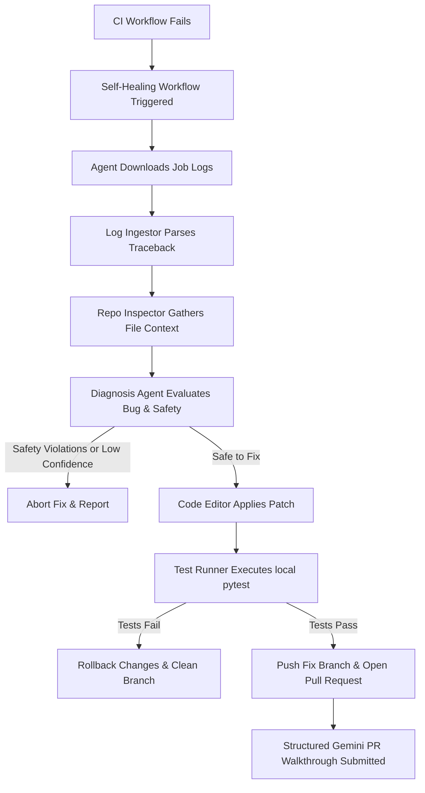

# Self-Healing CI/CD DevOps Agent

An autonomous, safe, and modular DevOps agent that monitors GitHub Actions failures, retrieves job execution logs, diagnoses the bugs using Google Gemini, applies targeted source repairs, runs local test suites, and opens pull requests with structured explanations.

---

## Architecture Flow



---

## Core Features

- **Automated Failure Ingestion**: Detects failures and downloads plain-text logs for the failing step.
- **Log filtering & Structured Parsing**: Minimizes token usage by filtering out unrelated execution logs and uses Gemini structured schemas to map exceptions, failing files, and failure types.
- **Context Gathering**: Gathers surrounding source code and inspects the failing commit's git diff.
- **Rule-based Safety Engine**: Aborts if a change touches credential variables, modifies CI workflow files, modifies authentication/payment files, or is classified as High Risk.
- **Local Verification & Rollback**: Runs test commands locally before committing. Reverts the workspace immediately on any failure.
- **Structured Pull Requests**: Generates formatted PR walkthroughs listing the what/why/how of the change.

---

## Tech Stack

- **Core Logic**: Python 3.10+
- **LLM Integration**: Google GenAI SDK (`google-genai` calling `gemini-2.5-flash`)
- **API Orchestration**: GitHub REST API (Requests) and PyGithub
- **Pydantic**: Structured response mapping
- **Testing**: pytest

---

## Getting Started

### Prerequisites

Clone this repository and navigate to the root directory:

```bash
cd self-healing-devops-agent
```

Install the dependencies:

```bash
pip install -r requirements.txt
```

### Environment Configuration

Copy the `.env.example` file to `.env`:

```bash
cp .env.example .env
```

Fill in your configuration keys:
1. `GITHUB_TOKEN`: A Personal Access Token (PAT) with repository read/write access.
2. `GEMINI_API_KEY`: Get an API Key from [Google AI Studio](https://aistudio.google.com/).
3. `SLACK_WEBHOOK_URL` (Optional): A webhook url to post real-time updates.

---

## Demo: Running the Self-Healing Loop Locally

To make it incredibly easy for recruiters or reviewers to test without configuring live remote actions, the agent has a built-in `--mock` mode that simulates external API endpoints while running on a real, local broken application.

### Step 1: Run the Demo Local Simulation

Run the agent on our included broken application `examples/broken-python-app`:

```bash
python agent/main.py --local-dir examples/broken-python-app --mock
```

You will see live streaming progress updates:
1. **[1/7] CI failure detected...**
2. **[2/7] Ingesting failed CI/CD error logs...** (Simulates downloading the traceback logs)
3. **[3/7] Inspecting suspected source and test files...** (Gathers contents from `calculator.py` and `test_calculator.py`)
4. **[4/7] Diagnosing root cause...** (Simulates bug analysis and safety checks)
5. **[5/7] Applying targeted code fix...** (Applies the logical fix to `calculator.py`)
6. **[6/7] Running test verification checks locally...** (Runs `pytest` inside the broken app folder; the tests will pass!)
7. **[7/7] Opening pull request...** (Formats and outputs the structured PR markdown description)

*After the run completes, you can inspect `examples/broken-python-app/calculator.py` and see the bug was fixed!*

---

## Safety Controls

The agent strictly enforces:
1. **No direct pushes to main**: Fixes are always isolated on branch `self-healing/fix-ci-<run-id>`.
2. **Infrastructure Protection**: The agent refuses to modify files in `.github/workflows/` or `Dockerfiles`.
3. **Credential Safeguards**: If code files contain secrets/tokens/keys, or if the fix touches authentication/payment configurations, the agent terminates.
4. **Confidence checks**: Aborts if the Gemini parsing engine confidence is below `0.65`.
